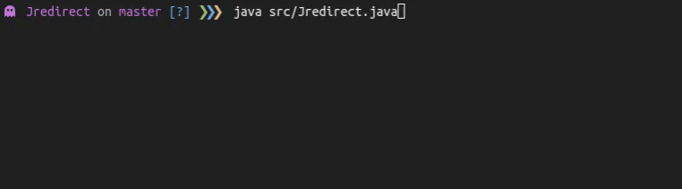

<div align="center">
   <h1>
      Jredirect
   </h1>
   <p align="center">
      A command-line tool that allows you to trace URL redirections written in Java.
      <br/>
      So you will never get rickrolled again.
   </p>
   
</div>

## Usage

```bash
$ java src/Jredirect.java -u <url>
```

## License

Distributed under the MIT License. See [`LICENSE.md`](./LICENSE.md) for more information.

