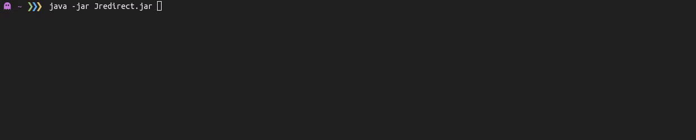

<div align="center">
   <h1>
      Jredirect
   </h1>
   <p align="center">
      A command-line tool that allows you to trace URL redirections written in Java.
      <br/>
      So you will never get rickrolled again.
   </p>
   
</div>

## Usage

```bash
$ java src/Jredirect.java <url>
```

Alternatively, if you are on a **Linux** system you can download the executable providede in the [`bin`](./bin/) directory.
When using the executable you can do the following to trace redirects.

```bash
$ Jredirect <url>
```

## Building a **LINUX** executable

Reference the [`README.md`](./build/README.md) inside the `build` directory.

## License

Distributed under the MIT License. See [`LICENSE.md`](./LICENSE.md) for more information.

